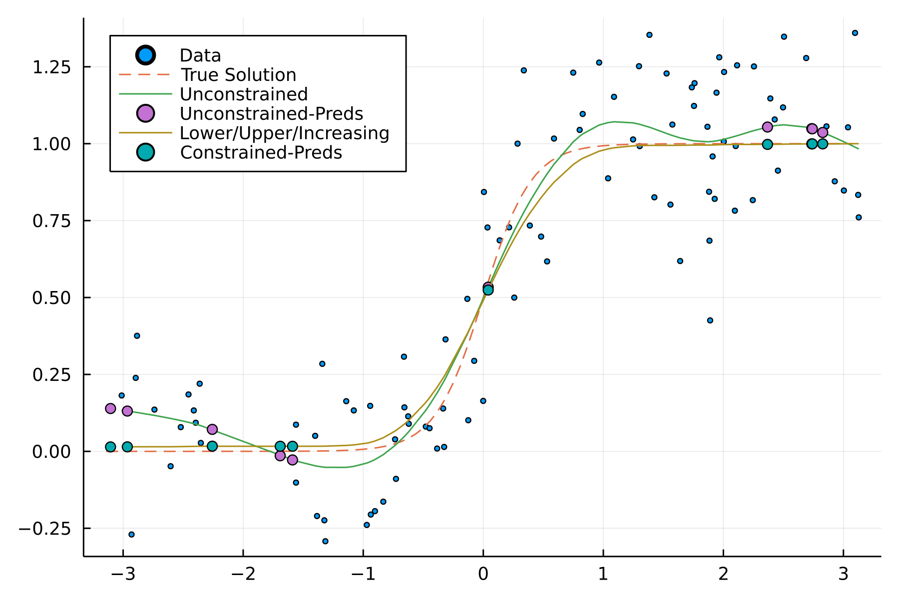

# GeneralizedSmoothingSplines.jl

[](https://github.com/mipals/GeneralizedSmoothingSplines.jl/actions/workflows/CI.yml?query=branch%3Amain)
[](https://codecov.io/gh/mipals/GeneralizedSmoothingSplines.jl)

A (experimental) Julia package for fitting Smoothing Splines of degrees $2p - 1$. This means solving the $p$-smoothing spline regression problem 

$$
\underset{s}{\text{minimize}} \quad \frac{1}{n}\sum_{i=1}^n\left(y_i - s(x_i)\right)^2 + \lambda\int_a^b|s^{(p)}(x)|^2\ \mathrm{d}x,
$$

where $(x_1,y_1),(x_2,y_2),\dots,(x_n,y_n)$ is a set of observation that satisfy $a < x_1 < x_2 < \dots < x_n < b$. It was shown in [1] that the solution to the $p$-smoothing spline regression problem is a natural spline of degree $2p - 1$ (or order $2p$), meaning that for $p=2$ the solution is the well-known Cubic spline. It has been shown the smoothing spline regression problem can be cast to a finite dimensional optimization problem as [2]

$$
\underset{c \in \mathbb{R}^n,\ d\in\mathbb{R}^p}{\text{minimize}} \quad \frac{1}{n}\left\Vert y - (\Sigma c + Hd)\right\Vert _2^2 + \lambda c^\top \Sigma c,
$$

where $\Sigma$ is a symmetric and positive semidefinite matrix with a so-called extended generator representable semiseparable (EGRSS) representation and $H$ is a Vandermonde matrix [3]. For EGRSS matrices all relevant linear algebra routines can be performed in $O(p^kn)$, resulting in computations with the same scaling as traditional algorithms for Cubic smoothing spline fitting [4]. The implementation of these routines can be found in the package [SymSemiseparableMatrices.jl](https://github.com/mipals/SymSemiseparableMatrices.jl).

From the optimality conditions of the optimization problem it can be shown that the coefficients $c$ and $d$ must satisfy the following system of equations

$$
\begin{bmatrix}
\Sigma + n\lambda I & H \\
H^\top & 0
\end{bmatrix}
\begin{bmatrix}
c \\ 
d
\end{bmatrix}
\text{=}
\begin{bmatrix}
y \\
0
\end{bmatrix},
\quad \Sigma \in \mathbb{R}^{n\times n},\ H \in \mathbb{R}^{n\times p},
$$

which is the system of equations that this package end up solving. The optimal value of $\lambda$ can be found through the generalized maximum likelihood as described in [3].

#### Shape Restrictions
In additional to the standard spline fit, the package provides the possibility of constraining various aspects of the spline, $s(x)$. Currently its supports constraints on the value of the spline as well as its first and second order derivatives using finite differences. This is done by solving the previously mentioned finite dimensional optimization problem with added constraints of the form

$$
l\ \leq\ D_r( \Sigma c + Hd)\ \leq\ u,
$$

where $D_r$ is diagonal for constraints on the value of the spline and a finite difference matrix for bounds on the derivatives. These ideas follow that of [5], but this implementation generalizes to grids of nonequidistant spacing. Note that the current implementation is *sloppy* in that it transform everything to dense matrices and solves a Quadratic Program (QP).

## Usage
```julia
using Plots, MLJ, LinearAlgebra, GeneralizedSmoothingSplines
n       = 100       # number of samples
sigma   = 0.2       # noise standard deviation
a,b     = -π,π      # interval [a,b]
delta   = b - a     # Interval width

# Simulating Data
X = a .+ sort(rand(n))*delta
f(t) = 1.0 ./ (1.0 .+ exp.(-5.0*t))
y = f(X) + sigma*randn(length(X))

# Creating 10 data points to predict
Xnew = a .+ sort(rand(10))*delta

# Fitting Smoothing Spline
spl = SmoothingSpline()
mach = machine(spl,X,y) 
tune!(mach)
preds = predict(mach,Xnew)

# Fitting Shape Restricted Spline
bounds = (0.0,1,0.0) # Min/Max/Strictly increasing
res_spl = SmoothingSpline(shape_restrictions=(:lowerbound,:upperbound,:increasing),bounds=bounds)
res_mach = machine(res_spl,X,y) 
tune!(res_mach)
res_preds = predict(res_mach,Xnew)

# Plotting Results
scatter(X,y, label="Data",legend=:topleft,ms=2)
plot!(a:delta/100:b,f(a:delta/100:b), label="True Solution",ls=:dash)
plot!(X, mach.fitresult[:fit],label="Unconstrained")
scatter!(Xnew,preds,label="Unconstrained-Preds")
plot!(X, res_mach.fitresult[:fit],label="Lower/Upper/Increasing")
scatter!(Xnew,res_preds,label="Constrained-Preds")
```



## Examples
* General usage *examples/forrester.jl* & *examples/motor.jl*.
* Shape restricted curves *examples/constrained.jl*, *examples/mixing_constraints.jl* & *examples/bounds.jl*.

## Related Packages
* [SmoothingSplines.jl](https://github.com/nignatiadis/SmoothingSplines.jl): Follows the style of R's `smooth.spline`. Does not have an automatic selection of λ. Does not include shape constraints.

## References
[1] I. J. Schoenberg, “Spline Functions and the Problem of Graduation”. 1964.

[2] G. Wahba, "Spline Models for Observational Data". SIAM, Jan. 1990.

[3] M. S. Andersen and T. Chen, “Smoothing Splines and Rank Structured Matrices: Revisiting the Spline Kernel”, SIAM Journal on Matrix Analysis and Applications, 2020.

[4] C. H. Reinsch "Smoothing by spline functions." Numerische mathematik 10.3 (1967): 177-183.

[5] H. C. Rytgaard, “Statistical models for robust spline smoothing”. MA thesis. University of Copenhagen, 2016.
